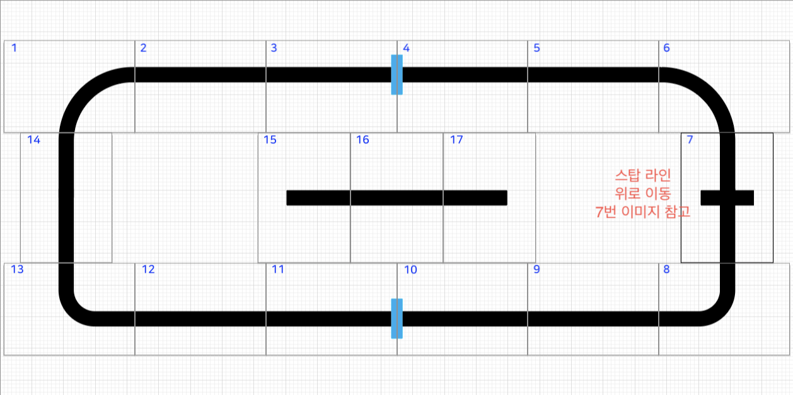

조이름 Note Looper
===
## 조원
20181600 김진석
20181610 박민서

## 문제 정의

위의 트랙을 사용하나 가이드 라인과 장애물을 배치하는 부분을 제거하고 사용자가 원하는 노트(음원)를 재생하기 위한 색 종이를 트랙 위에 놓을 것이다. 그리고 붉은 색을 T자형 주차 구간 근처에 배치하여 붉은 색을 3번 인식하게 되면 T자형 주차 구간에서 주차를 하도록 하여 주행을 끝마칠 것이다.

필수미션 : T자형 주차

센서 사용 : RGB센서, 5축 센서, 초음파센서, LED(디버깅용), 부저(디버깅용), 
 volume(속도 조절용)

## 자율미션

||내용|
|---|---|
|1|트랙에 놓여질 색종이의 색에 따라 각각 다른 음원이 재생되도록 할 것이다.|
|2|전방에 장애물이 존재하면 장애물이 사라질 때까지 주행을 멈추고, 음원이 재생되지 않도록 할 것이다.|

